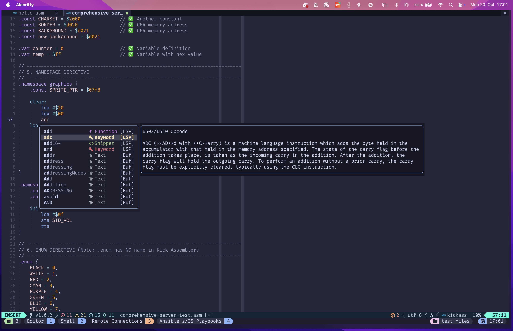
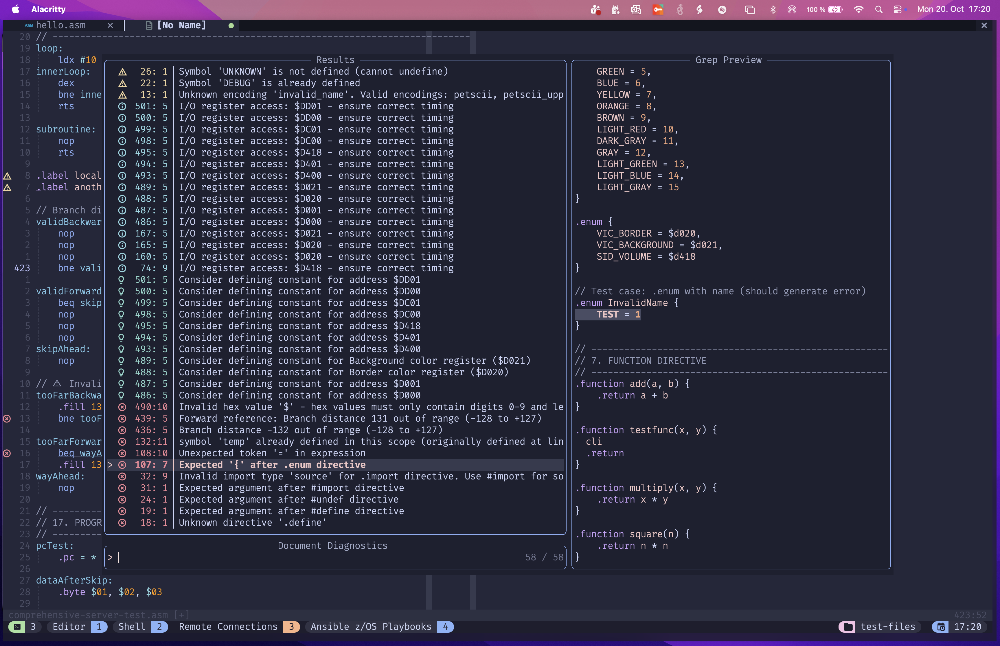
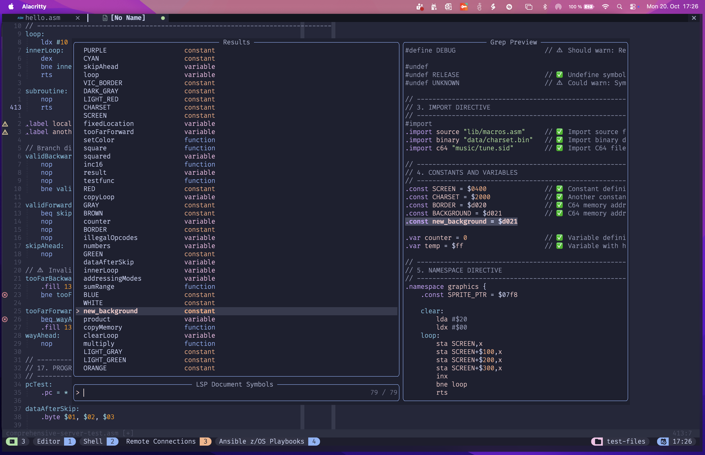
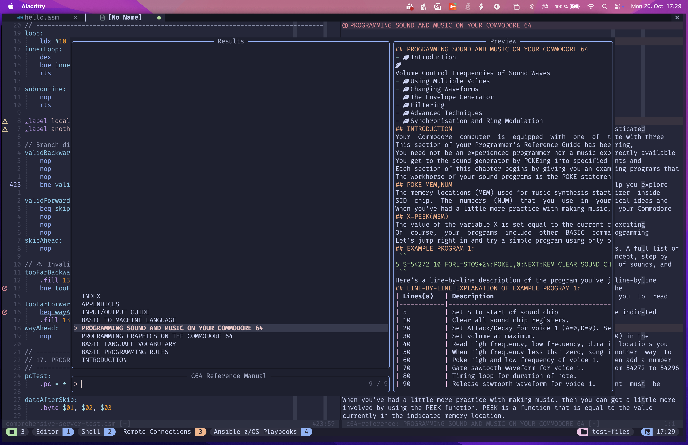
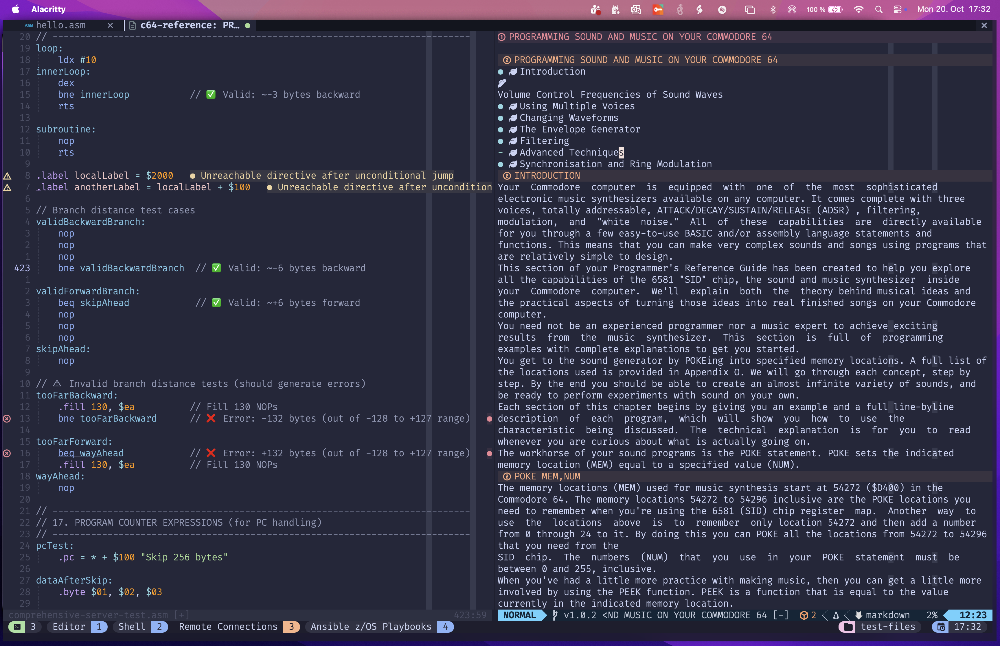
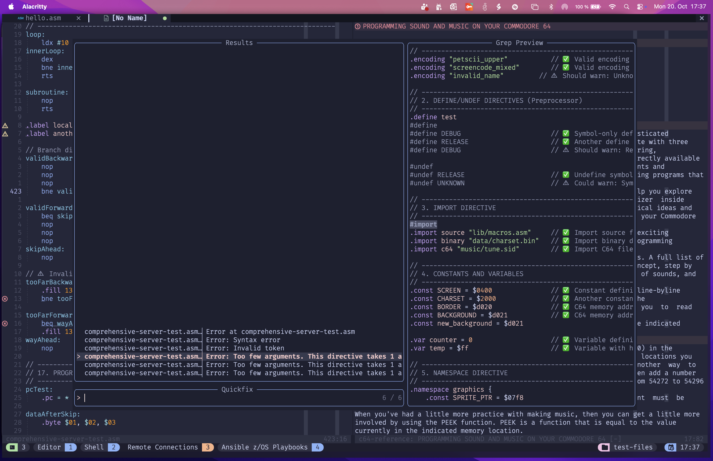
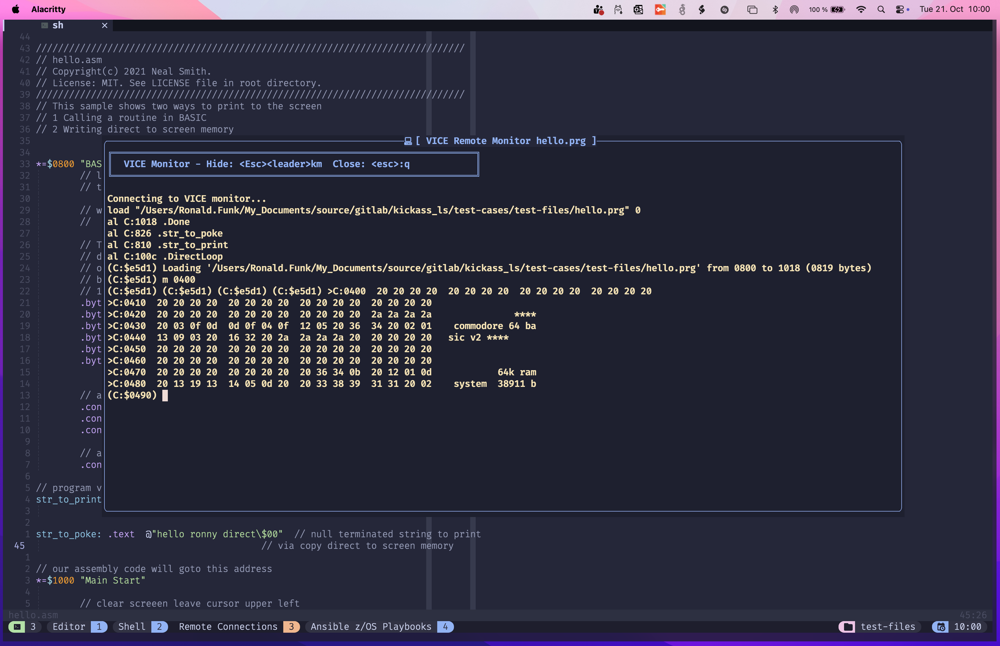

# c64.nvim

A Neovim plugin for C64 Assembler development using Kick Assembler, featuring LSP support, VICE emulator integration, and helpful development tools. Made with Love for the Retro Computing Community.

## Features

- **LSP Integration**: Full Language Server Protocol support via a Kick Assembler Language Server i created alongside this project [kickass_ls](https://github.com/cybersorcerer/kickass_ls)
  - Semantic token highlighting
  - Real-time diagnostics
  - Code completion
  - Symbol navigation
  - Advanced C64-specific analysis (zero-page optimization, hardware bug detection, etc.)

- **Build Integration**: Direct Kick Assembler compilation from Neovim
  - Automatic error parsing
  - Quickfix list integration
  - Success/error notifications

- **VICE Emulator Integration**: Launch and test your programs instantly
  - One-keypress execution
  - Automatic PRG file detection
  - Debug mode with VICE monitor and symbol file support
  - Remote monitor integration for advanced debugging

- **Telescope Integration**: Quick access to C64-specific references
  - **C64 Reference Manual Search** - Search and browse the complete C64 Programmer's Reference Guide directly in Neovim
  - Memory map browser
  - Register and constant lookup
  - Neovim quickfix list integration with Telescope for assembly errors

- **Diagnostic Display Modes**: Flexible diagnostic visualization
  - Virtual text mode (inline diagnostics)
  - Virtual lines mode (separate lines for diagnostics)
  - Signs only mode (minimal clutter)
  - Easy toggle between modes

- **C64 Ultimate Integration**: Direct hardware deployment (NEW!)
  - Upload and run programs on real C64 Ultimate hardware
  - One-command workflow: assemble → upload → run
  - Drive management (mount/unmount disk images)
  - Machine control (reset, memory operations)
  - Works with both Ultimate64 and Ultimate-II+ hardware

- **Customizable**: Extensive configuration options for LSP, highlighting, and keybindings

## Screenshots

### LSP Completion with nvim-cmp



Code completion with intelligent suggestions, inline documentation, and syntax highlighting powered by the Kick Assembler Language Server i created: [kickass_ls](https://github.com/cybersorcerer/kickass_ls).

### LSP Diagnostics


Real-time diagnostics with custom icons showing errors, warnings, and hints. Features include branch distance validation, dead code detection, and C64-specific hardware analysis. All powered by the Kick Assembler Language Server i created: [kickass_ls](https://github.com/cybersorcerer/kickass_ls).

### Telescope Diagnostics



Browse all diagnostics with Telescope (`<leader>dd` for current buffer, `<leader>dw` for workspace). Jump directly to any issue with preview. Diagnostics created by the Kick Assembler Language Server i created: [kickass_ls](https://github.com/cybersorcerer/kickass_ls).

### Telescope Symbol Navigation



Quick symbol navigation with `<leader>ts`. Browse all constants, variables, functions, and labels in your document with live preview.

### C64 Reference Manual (Work in Progress)



Search the C64 Programmer's Reference Manual with `<leader>cr`. Find information about SID, VIC, memory maps, and more.



Selected chapters open in a vertical split with full Markdown rendering for easy reading alongside your code.

**Note:** The C64 Reference integration is currently work in progress and may be subject to changes.

### Build Errors in Quickfix



When assembly fails, errors are automatically parsed and loaded into Telescope's quickfix list. Jump directly to any error with preview.

### VICE Remote Monitor



Debug your programs with the VICE remote monitor in a floating terminal. Supports symbol files, breakpoints, memory inspection, and all VICE monitor commands.

## Prerequisites

Before installing c64.nvim, ensure you have the following:

1. **Neovim 0.11+** - Required for native LSP features
2. **Java Runtime** - Required to run Kick Assembler
3. **Kick Assembler (kickass.jar)** - [Download here](http://theweb.dk/KickAssembler/)
4. **VICE Emulator** - [Download here](https://vice-emu.sourceforge.io/)
   - The `x64` binary must be in your PATH
5. **kickass_ls Language Server** - [Available here](https://github.com/cybersorcerer/kickass_ls)
   - The `kickass_ls` binary must be in your PATH
6. **telescope.nvim** (optional) - For enhanced UI features

### Optional Dependencies

- **nvim-cmp** - If installed, c64.nvim will automatically integrate with it for enhanced completion
  - When not installed, c64.nvim uses Neovim's native completion system
  - No additional configuration needed - auto-detection handles everything

- **c64u CLI** - For C64 Ultimate hardware integration ([See tools/c64u](tools/c64u/README.md))
  - Enables direct upload to C64 Ultimate hardware
  - Drive management and machine control from Neovim
  - See [Installing c64u CLI](#installing-c64u-cli) below for installation options

## Installation

### Installing c64.nvim Plugin

#### Using [lazy.nvim](https://github.com/folke/lazy.nvim)

Add this to your lazy.nvim plugin configuration (usually in `~/.config/nvim/lua/plugins/` or in your `init.lua`):

```lua
return {
  "cybersorcerer/c64.nvim",
  dependencies = {
    "nvim-telescope/telescope.nvim", -- Optional, for enhanced UI
    "hrsh7th/nvim-cmp", -- Optional, for enhanced completion (auto-detected)
  },
  ft = { "kickass" }, -- Lazy load only for Kick Assembler files
  config = function()
    require("c64").setup({
      -- Path to your kickass.jar file
      kickass_jar_path = vim.fn.expand("~/tools/kickass.jar"),

      -- Optional: customize paths if binaries are not in PATH
      -- vice_binary = "x64",
      -- kickass_ls_binary = "kickass_ls",
    })
  end,
}
```

### Installing c64u CLI

The c64u CLI tool enables direct interaction with C64 Ultimate hardware from Neovim. You can install it either by downloading pre-built binaries or by building from source.

#### Option 1: Download Pre-built Binary (Recommended)

Download the appropriate binary for your platform from the [GitHub Releases](https://github.com/cybersorcerer/c64.nvim/releases) page:

**macOS:**

```bash
# For Apple Silicon (M1/M2/M3)
curl -L -o c64u https://github.com/cybersorcerer/c64.nvim/releases/latest/download/c64u-darwin-arm64
chmod +x c64u
sudo mv c64u /usr/local/bin/

# For Intel Macs
curl -L -o c64u https://github.com/cybersorcerer/c64.nvim/releases/latest/download/c64u-darwin-amd64
chmod +x c64u
sudo mv c64u /usr/local/bin/
```

**Linux:**

```bash
# For x86_64
curl -L -o c64u https://github.com/cybersorcerer/c64.nvim/releases/latest/download/c64u-linux-amd64
chmod +x c64u
sudo mv c64u /usr/local/bin/

# For ARM64 (e.g., Raspberry Pi)
curl -L -o c64u https://github.com/cybersorcerer/c64.nvim/releases/latest/download/c64u-linux-arm64
chmod +x c64u
sudo mv c64u /usr/local/bin/
```

**Windows:**

```powershell
# Download from: https://github.com/cybersorcerer/c64.nvim/releases/latest/download/c64u-windows-amd64.exe
# Rename to c64u.exe and add to your PATH
```

#### Option 2: Build from Source

Requirements:

- Go 1.22 or later

```bash
cd tools/c64u
make install
```

This will build and install c64u to `~/.local/bin/` (make sure it's in your PATH).

#### Verify Installation

```bash
c64u version
```

#### Configure c64u

Create a configuration file at `~/.config/c64u/config.toml`:

```toml
# C64 Ultimate hostname or IP address
host = "c64u.local"  # or use IP like "192.168.1.100"

# HTTP port (default: 80)
port = 80
```

Alternatively, use environment variables:

```bash
export C64U_HOST="c64u.local"
export C64U_PORT=80
```

Or specify on the command line:

```bash
c64u --host c64u.local --port 80 about
```

#### Enable in c64.nvim

Once c64u is installed and configured, enable it in your c64.nvim configuration:

```lua
require("c64").setup({
  -- ... other config ...

  c64u = {
    enabled = true,                    -- Enable C64 Ultimate integration
    host = nil,                        -- Use c64u CLI config (recommended)
    port = nil,                        -- Use c64u CLI config (recommended)
  },
})
```

Now you can use the C64 Ultimate keymaps (`<leader>ku*`) to upload, run, and manage your programs on real hardware!

## Configuration

### Full Configuration Example

```lua
require("c64").setup({
  -- Path to kickass.jar
  kickass_jar_path = vim.fn.expand("~/tools/kickass.jar"),

  -- VICE emulator binary name (must be in PATH)
  vice_binary = "x64",

  -- Language server binary name (must be in PATH)
  kickass_ls_binary = "kickass_ls",

  -- LSP configuration
  lsp = {
    -- Completion mode: 'auto' (default), 'native', 'external', 'none'
    -- 'auto': Auto-detects nvim-cmp and uses it if available, otherwise native completion
    -- 'native': Forces Neovim native completion (vim.lsp.completion)
    -- 'external': Uses external completion plugin (e.g., nvim-cmp) only
    -- 'none': Disables completion
    completion = 'auto',

    settings = {
      kickass_ls = {
        warnUnusedLabels = false,
        zeroPageOptimization = {
          enabled = true,
          showHints = true,
        },
        branchDistanceValidation = {
          enabled = true,
          showWarnings = true,
        },
        illegalOpcodeDetection = {
          enabled = true,
          showWarnings = true,
        },
        hardwareBugDetection = {
          enabled = true,
          showWarnings = true,
          jmpIndirectBug = true,
        },
        memoryLayoutAnalysis = {
          enabled = true,
          showIOAccess = true,
          showStackWarnings = true,
          showROMWriteWarnings = true,
        },
        magicNumberDetection = {
          enabled = true,
          showHints = true,
          c64Addresses = true,
        },
        deadCodeDetection = {
          enabled = true,
          showWarnings = true,
        },
        styleGuideEnforcement = {
          enabled = true,
          showHints = true,
          upperCaseConstants = true,
          descriptiveLabels = true,
        },
      },
    },
  },

  -- Customize syntax highlighting
  highlight = {
    ['@lsp.type.mnemonic.kickass'] = { link = 'Function' },
    ['@lsp.type.directive.kickass'] = { link = 'Keyword' },
    ['@lsp.type.preprocessor.kickass'] = { link = 'PreProc' },
    ['@lsp.type.macro.kickass'] = { link = 'Macro' },
    ['@lsp.type.pseudocommand.kickass'] = { link = 'Special' },
    ['@lsp.type.function.kickass'] = { link = 'Function' },
    ['@lsp.type.label.kickass'] = { link = 'Label' },
    ['@lsp.type.number.kickass'] = { fg = '#ff9800' },
    ['@lsp.type.variable.kickass'] = { link = 'Identifier' },
  },

  -- Customize keybindings
  keymaps = {
    assemble = "<leader>ka",
    run_vice = "<leader>kr",
    debug_vice = "<leader>kd",
    show_diagnostics = "<leader>d",
  },

  -- C64 Ultimate integration (optional)
  c64u = {
    enabled = true,                         -- Enable C64 Ultimate integration
    host = "c64u.homelab.local",           -- C64U hostname/IP (nil = use c64u CLI config)
    port = 80,                             -- HTTP port (nil = use c64u CLI config)
  },
})
```

### Completion

c64.nvim sets `omnifunc` for LSP completion and works seamlessly with:

- **nvim-cmp** (recommended) - automatic integration
- **Manual completion** - trigger with `<C-x><C-o>`

### Important: Avoiding Dual Completion Menus

If you have a **global LspAttach autocmd** that enables native completion for all LSP clients, you may see **duplicate completion menus** (one from native completion, one from nvim-cmp).

**Solution**: Skip kickass_ls in your global completion setup:

```lua
vim.api.nvim_create_autocmd("LspAttach", {
  callback = function(ev)
    local client = vim.lsp.get_client_by_id(ev.data.client_id)

    -- Skip native completion for kickass_ls (uses nvim-cmp)
    if client and client.name == "kickass_ls" then
      return
    end

    -- Enable native completion for other LSP clients
    if client:supports_method("textDocument/completion") then
      vim.lsp.completion.enable(true, client.id, ev.buf, { autotrigger = true })
    end
  end,
})
```

### Integration with Existing LSP Setup

c64.nvim uses **native Neovim LSP** (`vim.lsp.start`) and integrates seamlessly with your existing setup:

**What c64.nvim configures:**

- LSP server registration and activation
- Diagnostic signs and virtual text styling
- Semantic token highlighting for Kick Assembler
- Completion (based on `completion` mode)

**What c64.nvim does NOT configure:**

- LSP keybindings (uses your global `LspAttach` autocmd)
- General diagnostic behavior (only adds c64-specific enhancements)

This design ensures c64.nvim works harmoniously with your existing Neovim configuration without requiring nvim-lspconfig.

## Keybindings

### Default Keymaps

#### Build & Run

| Key | Action | Description |
|-----|--------|-------------|
| `<leader>ka` | Assemble | Compile current file with Kick Assembler |
| `<leader>kr` | Run | Launch current program in VICE emulator |
| `<leader>kd` | Debug | Launch VICE with monitor and symbol file |

#### Diagnostics

| Key | Action | Description |
|-----|--------|-------------|
| `<leader>d` | Show Diagnostics | Show line diagnostics in floating window |
| `<leader>dv` | Virtual Text Mode | Enable inline diagnostic text |
| `<leader>dl` | Virtual Lines Mode | Enable diagnostic lines (requires lsp_lines.nvim) |
| `<leader>ds` | Signs Only Mode | Show only diagnostic icons in sign column |
| `<leader>dt` | Toggle Mode | Cycle through diagnostic display modes |

#### C64 Reference & Tools

| Key | Action | Description |
|-----|--------|-------------|
| `<leader>cr` | C64 Reference | Search C64 Programmer's Reference Manual |
| `<leader>cm` | Memory Map | Browse C64 memory map |
| `<leader>cR` | Registers | Browse C64 registers and constants |
| `<leader>dd` | Buffer Diagnostics | Show diagnostics for current buffer only (requires Telescope) |
| `<leader>dw` | Workspace Diagnostics | Show diagnostics for all buffers (requires Telescope) |
| `<leader>cs` | Telescope Symbols | Show document symbols (requires Telescope) |

#### C64 Ultimate (requires c64u CLI and enabled in config)

| Key | Action | Description |
|-----|--------|-------------|
| `<leader>kuR` | Assemble & Upload | Assemble and upload to C64 Ultimate, then run |
| `<leader>kuu` | Upload PRG | Telescope picker to select and upload PRG file |
| `<leader>kud` | File Browser | FTP file browser for C64 Ultimate filesystem |
| `<leader>kux` | Machine Control | Telescope picker for machine operations (reset/reboot/pause/resume/poweroff) |
| `<leader>kuv` | Version | Show C64 Ultimate API version |
| `<leader>kuc` | Create Disk Image | Create disk image (d64/d71/d81/dnp) |
| `<leader>kum` | Create Directory | Create directory on C64U partition |

**FTP File Browser (`<leader>kud`):**

**Prerequisites:** Requires an FTP client (`ftp` or `ftp.exe`) in your PATH.

Navigation:

- `Enter` on directory - Navigate into directory
- `Enter` on file - Show file information
- `..` entry - Navigate to parent directory

Operations:

- `Ctrl+c` - Create disk image (d64/d71/d81/dnp) in current directory
- `Ctrl+d` - Create new directory via FTP
- `Ctrl+m` - Mount selected disk image (drive name extracted from path)
- `Ctrl+u` - Unmount disk image from drive

**Machine Control (`<leader>kux`):**

- `Enter` - Execute selected command (picker stays open for multiple operations)
- Available operations: Reset, Reboot, Pause, Resume, Power Off (U64 only)
- `Esc` - Close the picker
- `Ctrl-c` - Close the picker (alternative)

### LSP Keymaps

These are automatically set when editing Kick Assembler files:

| Key | Action | Description |
|-----|--------|-------------|
| `gD` | Go to Declaration | Jump to symbol declaration |
| `gd` | Go to Definition | Jump to symbol definition |
| `K` | Hover | Show documentation |
| `gi` | Go to Implementation | Jump to implementation |
| `<C-k>` | Signature Help | Show function signature |
| `gr` | References | Show all references |
| `<space>rn` | Rename | Rename symbol |
| `<space>ca` | Code Action | Show code actions |
| `<space>f` | Format | Format document |

## Commands

The plugin provides the following user commands:

| Command | Description |
|---------|-------------|
| `:C64Assemble` | Assemble the current file with Kick Assembler |
| `:C64Run` | Run the current program in VICE emulator |
| `:C64Debug` | Run the program in VICE with debug mode enabled |
| `:C64Enable` | Manually enable c64.nvim for current buffer |
| `:C64CreateMarker` | Create `.kickass` marker file in current directory |

## Telescope Extension

c64.nvim provides powerful Telescope integrations for enhanced development workflow:

### C64 Reference Manual Search

Press `<leader>cr` to search the complete C64 Programmer's Reference Guide:

- **Fuzzy search** through all sections (searches both titles and content)
- **Live preview** of sections as you navigate
- **Vertical split** display - see reference alongside your code
- **Markdown rendering** with syntax highlighting
- No need to leave Neovim or open PDFs!

**Usage:**

```vim
:Telescope c64 reference
# or use the keymap:
<leader>cr
```

Type to search (e.g., "sprite", "vic", "sid"), navigate with `j/k`, press `Enter` to open in a split.

### Memory Map & Registers

Browse C64 memory locations and hardware registers:

```vim
:Telescope c64 memory_map    # or <leader>cm
:Telescope c64 registers     # or <leader>cR
```

Select an entry to insert it at your cursor position.

## File Type Detection

The plugin uses intelligent multi-level detection to identify Kick Assembler files and avoid conflicts with other assemblers (NASM, MASM, etc.).

### Automatic Detection

Files with extensions `*.asm`, `*.s`, or `*.inc` are automatically analyzed using this strategy:

#### Level 1: Kick Assembler Directives (Most Reliable)

- Detects Kick Assembler-specific syntax like `.import`, `.macro`, `.namespace`, `.var`, etc.
- If found, filetype is set to `kickass`

#### Level 2: Project Marker File

- Searches for `.kickass`, `kickass.cfg`, or `.kickassembler` file in the project directory tree
- If found, all `.asm` files in that project are treated as Kick Assembler files

#### Level 3: C64-Specific Patterns (Hints)

- Detects C64-specific memory addresses and Kernal routines (e.g., `$D000`, `CHROUT`)
- Requires at least 2 C64-specific references to trigger

### Manual Activation

If automatic detection doesn't work, you can manually enable c64.nvim:

```vim
:C64Enable
```

This command sets the current buffer's filetype to `kickass` and activates all plugin features.

### Project Marker File

To ensure all `.asm` files in your project are recognized as Kick Assembler files, create a marker file:

```vim
:C64CreateMarker
```

This creates a `.kickass` file in your current working directory. All `.asm` files in this directory (and subdirectories) will automatically be detected as Kick Assembler files.

You can also manually create this file:

```bash
touch .kickass
```

Or create a `kickass.cfg` with your Kick Assembler configuration.

## Diagnostic Display Modes

c64.nvim offers flexible diagnostic visualization with three display modes:

### Virtual Text Mode (Default)

Diagnostics appear inline next to your code:

```asm
10: lda #$00    ● Error: Invalid syntax
```

### Virtual Lines Mode

Diagnostics appear in separate lines below the code (requires [lsp_lines.nvim](https://git.sr.ht/~whynothugo/lsp_lines.nvim)):

```asm
10: lda #$00
    ┗━ Error: Invalid syntax
```

### Signs Only Mode

Only icons appear in the sign column, minimal distraction:

```asm
󰅚 10: lda #$00
```

Use `<leader>d` to see full diagnostics in a floating window.

### Diagnostic Icons

- Error: 󰅚 (red alert circle)
- Warning: 󰀪 (yellow alert)
- Hint: 󰌶 (blue lightbulb)
- Info: 󰋽 (cyan information)

## Workflow Example

### Basic Development Cycle

1. **Open** a Kick Assembler file: `nvim myprogram.asm`
2. **Write** your code with LSP assistance (completions, diagnostics, etc.)
3. **Need help?** Press `<leader>cr` to search the C64 Reference Manual
4. **Assemble**: Press `<leader>ka` to compile
5. **Errors?** Telescope opens with clickable error list
6. **Fix** errors and reassemble
7. **Test**: Press `<leader>kr` to launch VICE and test your program
8. **Debug**: Press `<leader>kd` to launch VICE with monitor and symbols loaded

### Debugging with VICE Monitor

When you press `<leader>kd`, the plugin:

1. Starts VICE with the `-remotemonitor` flag (enables remote monitor on port 6510)
2. Automatically loads your `.sym` symbol file with `-moncommands`
3. Shows a notification with monitor activation instructions

**In VICE:**

- Press `Alt+H` to activate the monitor
- Use your labels directly in monitor commands (e.g., `break Main`, `d loop`)
- Monitor commands: `break`, `watch`, `d` (disassemble), `m` (memory), `r` (registers), `z` (continue)

**Example debug session:**

```monitor
(monitor) break Main          # Set breakpoint at Main label
(monitor) z                   # Continue execution
(monitor) r                   # Show registers
(monitor) d Main Main+20      # Disassemble from Main to Main+$20
(monitor) m $0400 $04ff       # Show screen memory
```

### Using the C64 Reference

1. Press `<leader>cr` to open the reference search
2. Type to search (e.g., "sprite" or "vic")
3. See live preview in Telescope
4. Press `Enter` to open in vertical split
5. Reference stays open while you code
6. Press `q` to close the reference

## Troubleshooting

### LSP not starting

- Ensure `kickass_ls` is in your PATH: `which kickass_ls`
- Check Neovim's LSP logs: `:LspLog`

### Assembly fails

- Verify your `kickass_jar_path` is correct
- Ensure Java is installed: `java -version`
- Check the error in the Neovim quickfix list: `:copen`

### VICE not launching

- Ensure `x64` is in your PATH: `which x64`
- Make sure you assembled the file first (`<leader>ka`)
- Check that a `.prg` file was created

## Contributing

Contributions are welcome! Please feel free to submit issues or pull requests.

## License

Apache 2.0

## Credits

- Built for [Kick Assembler](http://theweb.dk/KickAssembler/) by Mads Nielsen
- Integrates with [VICE Emulator](https://vice-emu.sourceforge.io/)
- Uses [kickass_ls](https://github.com/cybersorcerer/kickass_ls) Language Server
- Uses Documentation from the great Retro Community
  - The Commodore Reference Guide by **\[PS(hv)\]** which you can find [here](https://pickledlight.blogspot.com/p/retro-computing-c64-projects.html)
- Data from [The Commodore 64 Memory Map](https://sta.c64.org/cbm64mem.html)